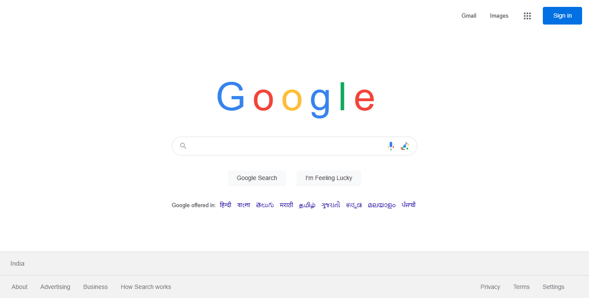

# 🔍 Google Homepage Clone


A beginner-friendly recreation of Google's homepage using HTML, CSS, JavaScript, and Bootstrap.

## 📸 Screenshots

<div align="center">
  
  <p><em>Pixel-perfect recreation of Google's homepage with authentic design and functionality</em></p>
</div>

## 🚀 Live Demo

[View Live Google Homepage](https://google-homepage-shibam.vercel.app)

## 📁 Project Structure

```
google-homepage-shibam/
├── 📄 index.html          # Main HTML file with page structure
├── 🎨 styles.css          # Custom CSS styling for Google look
├── ⚡ script.js           # JavaScript for search functionality
├── 📸 screenshot/         # Project screenshots
│   └── google-homepage-shibam.png
├── 📖 README.md           # Project documentation (this file)
├── 📜 LICENSE             # MIT License
└── 🚫 .gitignore          # Git ignore file
```

## 🛠️ Technologies Used

<table>
<tr>
<td align="center"><br><b>HTML5</b></td>
<td align="center"><br><b>CSS3</b></td>
<td align="center"><br><b>JavaScript</b></td>
<td align="center"><br><b>Bootstrap</b></td>
</tr>
</table>

## 📝 Commit History

This project was developed through 5 key commits:

1. **init** - Initial project setup and basic file structure
2. **layout** - HTML structure and basic page layout with Bootstrap
3. **center search box** - Centered search box with Google styling and positioning
4. **buttons functionality** - Added interactive functionality to search buttons and voice/camera icons
5. **docs** - Documentation updates and project finalization

## 🚀 How to Run

1. **Download the project** to your computer
2. **Open `index.html`** in any web browser (Chrome, Firefox, Safari, etc.)
3. **That's it!** No installation needed - it's a simple HTML project

## ✨ Features

- **Authentic Google Design**: Pixel-perfect recreation of Google's homepage
- **Interactive Search Box**: Click to focus, type to search
- **Working Buttons**: 
  - "Google Search" button shows search alert
  - "I'm Feeling Lucky" button shows lucky alert
- **Keyboard Support**: Press Enter to search
- **Voice & Camera Icons**: Click for demo alerts
- **Apps Menu**: 9-dot grid button with click functionality
- **Responsive Design**: Works on desktop, tablet, and mobile
- **Language Options**: Multiple Indian language links
- **Footer Links**: Complete footer with Google-style links

## 🛠️ Technologies Used

- **HTML5**: Page structure and content
- **CSS3**: Styling and responsive design
- **JavaScript**: Interactive functionality
- **Bootstrap 5**: Grid system and responsive utilities

## 📱 Browser Support

Works in all modern browsers:
- Chrome ✅
- Firefox ✅
- Safari ✅
- Edge ✅

## 🎯 Learning Goals

This project demonstrates:
- Basic HTML structure
- CSS styling and layout
- JavaScript event handling
- Responsive web design
- Bootstrap framework usage

## 📝 Code Structure

### HTML (`index.html`)
- Clean, semantic HTML structure
- Bootstrap classes for responsive layout
- Proper accessibility attributes

### CSS (`styles.css`)
- Google-accurate colors and fonts
- Flexbox for centering
- Hover and focus effects
- Mobile-responsive breakpoints

### JavaScript (`script.js`)
- Event listeners for user interactions
- Search functionality with alerts
- Focus management
- Simple and well-commented code

## 🤝 Contributing

Feel free to fork this project and make improvements! Some ideas:
- Add more interactive features
- Improve mobile responsiveness
- Add animations
- Create actual search functionality

## 📄 License

This project is licensed under the MIT License - see the [LICENSE](LICENSE) file for details.

## 🎓 Educational Use

This project is perfect for:
- Learning HTML, CSS, and JavaScript basics
- Understanding responsive web design
- Practicing Bootstrap framework
- Building portfolio projects

---

**Note**: This is a clone for educational purposes only. Google and the Google logo are trademarks of Google Inc.
